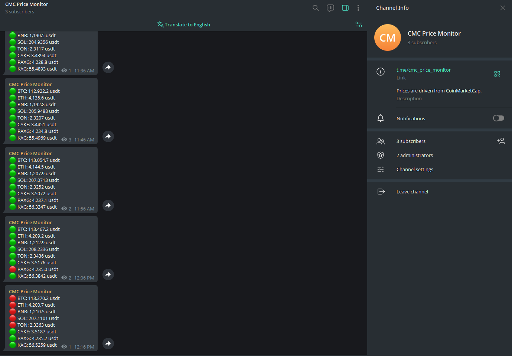

# FastAPI CoinMarketCap Crawler

A Dockerized FastAPI application that crawls the top 50 high-volume cryptocurrencies from CoinMarketCap and sends their prices to a Telegram channel.

**📱 Live Prices Channel:** [@eye_on_crypto](https://t.me/eye_on_crypto)

## Configuration

To run this application, you need to configure the following environment variables:

- **TELEGRAM_BOT_TOKEN**: Your Telegram bot token (get it from [@BotFather](https://t.me/botfather))
- **TELEGRAM_CHAT_ID**: Your Telegram channel/chat ID where prices will be sent
- **CMC_API_KEY**: Your CoinMarketCap API key (get it from [CoinMarketCap Developer Portal](https://coinmarketcap.com/api/))

These can be set as environment variables or added to a `.env` file in the project root.
